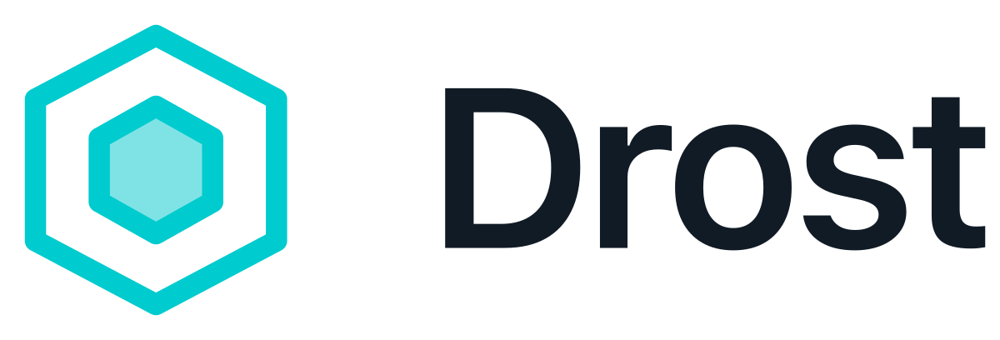

<p align="center">
  <picture>
    <source media="(prefers-color-scheme: dark)" srcset="assets/drost-lockup-on-dark.svg">
    <source media="(prefers-color-scheme: light)" srcset="assets/drost-lockup-on-light.svg">
    
  </picture>
</p>

<h1 align="center">Drost Community Edition</h1>

<p align="center"><strong>The open-source, container-native MCP security toolkit from Drost.</strong></p>

<p align="center">
  <a href="https://www.drost.ai/">Drost</a> ·
  <a href="https://edge.drost.ai/">Drost Edge</a> ·
  <a href="https://www.drost.ai/elite">Drost Swarm</a> ·
  <a href="LICENSE">Apache-2.0</a>
</p>

Drost Community Edition is the public release of **Drost-v1**: one Kali-based
Docker image containing an MCP server, 105 executable-backed security tools,
GNU grep and jq for engagement artifact analysis, and 52 Drost-native execution,
engagement, API, HTTP, browser, security, and workflow tools for agent-driven
and operator-driven security work.

It runs over stdio, publishes no network service, and works with Tess and other
MCP clients that can launch a local command. Images can be built for
`linux/amd64` and `linux/arm64`, including Apple Silicon hosts through
Docker Desktop.

> Use Drost only against systems you own or are explicitly authorized to test.
> The software provides capability, not permission.

## Where Drost began

Drost has gone through four major architectural generations:

1. **Drost-v1 — Community Edition:** the container-native MCP security toolkit
   released in this repository.
2. **Drost-v2 — Drost Edge:** customer-controlled autonomous security from the
   terminal.
3. **Drost-v3 — Drost Platform:** hosted autonomous assessment with a recursive
   self-improvement loop.
4. **Drost-v4 — Drost Swarm:** coordinated offensive agents combined with human
   judgment in Drost's current fourth-generation system.

Each generation introduced a different operating model and a substantial
capability jump. Community Edition is not a copy of the closed-source Drost
products and does not contain their proprietary runtimes, orchestration,
control planes, or multi-agent systems. It is a useful, extensible release of
the original Drost foundation.

## What is included

- **159 offensive-security MCP tools:** 107 executable-backed tools and 52
  Drost-native execution, engagement, API, HTTP, browser, security, and workflow
  tools. The catalog includes grep, jq, Bash, Python, browser automation, and
  persistent engagement workspaces.
- **One container:** the MCP server and its security executables share the same
  Kali-based image.
- **Direct stdio transport:** no HTTP API, listening port, or separate worker
  service.
- **Full MCP mode by default:** all 159 named tools are advertised directly so
  the model can select recognizable tools such as `drost_nmap`,
  `drost_httpx`, and `drost_nuclei`.
- **Persistent isolated engagements:** the server generates a random engagement
  ID and keeps its inputs and outputs under
  `/workspace/engagements/<engagement_id>`.
- **Multi-architecture builds:** one Dockerfile for `linux/amd64` and
  `linux/arm64`.
- **Client-owned execution limits:** Drost does not impose artificial execution
  timeouts or truncate tool output. The MCP client controls its request
  deadlines, cancellation, and context handling. Client cancellation terminates
  the executable process group without blocking other MCP calls.
- **Explicit execution semantics:** catalog executables receive argv arrays with
  no shell parsing; arbitrary shell behavior is available only when the caller
  deliberately selects `drost_bash`.

## Tool coverage

The executable-backed catalog includes:

| Family | Tools | Examples |
| --- | ---: | --- |
| Network | 10 | Nmap, RustScan, Masscan, tcpdump, TShark |
| Enumeration and OSINT | 16 | Amass, Subfinder, enum4linux-ng, NetExec |
| Web and API | 30 | Nuclei, HTTPX, FFUF, SQLMap, Katana, Dalfox |
| Credentials | 8 | Hydra, John the Ripper, Hashcat |
| Exploitation | 3 | Metasploit, Msfvenom, SearchSploit |
| Binary analysis | 14 | GDB, Ghidra, Radare2, checksec, Pwntools |
| Forensics | 11 | Volatility, Foremost, ExifTool, Sleuth Kit |
| Cloud, containers, and IaC | 8 | Prowler, Trivy, Checkov, kube-bench |
| Wireless | 5 | Aircrack-ng, Airmon-ng, Airodump-ng, Kismet |
| Utilities | 2 | GNU grep, jq |

Drost-native tools add Bash and Python execution, filtered catalog discovery,
workspace operations, evidence-backed OpenAPI, GraphQL, JWT and API fuzz
auditing, a persistent scoped HTTP repeater/intruder workbench, containerized
Chromium automation, CVE lookup, file hashing, indicator extraction,
engagement planning, tool recommendations, attack-chain organization, and scan
summaries.

Use `drost_catalog(name="drost_python", include_contracts=true)` for one exact
contract or `drost_catalog(query="json")` for concise discovery. An unfiltered
call returns counts instead of dumping the complete catalog.

## Architecture

```text
MCP client
    |
    | stdio
    v
docker exec -i drost-ai drost-mcp
    |
    +-- Drost-native tool
    |
    +-- catalog adapter --> executable inside the container
    |
    +-- Bash / Python / jq
    |
    +-- API audit + persisted HTTP workbench
    |
    +-- headless Chromium browser context
    |
    +-- /workspace/engagements/<engagement_id>
                         --> persistent isolated engagement artifacts
```

The server publishes no ports. The persistent container is simply the
execution environment in which the client starts `drost-mcp`.

## Engagement namespaces

Drost deliberately has no server-side "current engagement." The MCP client
owns that selection, while the server owns identifier generation and storage.
This keeps OpenCode, Pi, Tess, and other clients from changing shared global
state when they use the same container.

At the beginning of new work, call `drost_engagement_create` with a descriptive
name and the authorized targets. Drost returns a collision-resistant identifier
such as:

```text
eng_20261009_9f8d4c1a6b2743f4a2c11bb8d02a91a7
```

The client must retain that identifier and supply it as `engagement_id` to
every executable-backed or workspace-backed tool call. To resume work after a
client restart, call `drost_engagement_list`, select the intended engagement,
and optionally inspect it with `drost_engagement_get`.

Domain names, targets, and human-readable engagement names are stored as
metadata in `engagement.json`; they are not used as directory identifiers.
Existing files stored directly under `/workspace` by earlier releases remain
untouched and are not exposed through a new engagement namespace.

Engagement namespaces prevent accidental artifact mixing; they are not an
authorization boundary against a deliberately hostile executable. Use a
separate container and volume when separate operators or trust domains require
hard isolation.

## Agent execution and interactive testing

`drost_bash` deliberately executes arbitrary Bash inside the container. It
supports pipelines, redirects, stdin and environment overrides while retaining
asynchronous process groups, client cancellation and complete output.
`drost_python` runs inline source or engagement-relative scripts in the Drost
Python environment. Both default to the selected engagement directory, but
arbitrary code can access the wider container; the container remains the trust
boundary.

For structured data, prefer `drost_jq`. For API work, use the specialized
`drost_openapi_audit`, `drost_graphql_audit`, `drost_jwt_audit` and
`drost_api_fuzz` tools. Audit results are persisted beneath the engagement and
are explicitly reported as review evidence rather than automatically validated
vulnerabilities.

The HTTP workbench uses persistent, server-generated `http_*` session IDs. It
stores scope, headers, cookies and match/replace rules and provides repeater,
sniper-style intruder and complete history tools. Clients must pass both the
engagement and HTTP session IDs; there is no global current session.

Browser tools launch headless Chromium inside the container. A live `browser_*`
session supports navigation, DOM/ARIA snapshots, selector actions, screenshots,
JavaScript, cookies and storage, network logs and request interception rules.
Browser sessions are process-scoped and must be closed with
`drost_browser_close`; screenshots and other artifacts remain in the engagement.

## Install

Requirements:

- Docker Engine or Docker Desktop on an AMD64 or ARM64 host
- An MCP client such as Tess, OpenCode, Pi, Codex, Claude Code, or Gemini CLI

Install or upgrade Drost Community Edition with one command:

```sh
curl -fsSL https://drost.ai/community/install.sh | bash
```

The installer pulls the versioned multi-platform image, creates a persistent
workspace volume, starts the `drost-ai` container, and runs the MCP self-test.
It never requires `sudo` and will not replace a container it does not own.

To install manually instead:

```sh
docker pull ghcr.io/drost-ai/drost-community:1.0.0
docker run -d \
  --name drost-ai \
  --restart unless-stopped \
  -v drost-ai-workspace:/workspace \
  ghcr.io/drost-ai/drost-community:1.0.0
```

Verify the MCP installation:

```sh
docker exec drost-ai drost-mcp --self-test
```

Inspect the immutable image digest and verify its signed provenance and
CycloneDX SBOM attestations with the GitHub CLI:

```sh
docker buildx imagetools inspect ghcr.io/drost-ai/drost-community:1.0.0
gh attestation verify \
  oci://ghcr.io/drost-ai/drost-community:1.0.0 \
  --repo drost-ai/drost-community
gh attestation verify \
  oci://ghcr.io/drost-ai/drost-community:1.0.0 \
  --repo drost-ai/drost-community \
  --predicate-type https://cyclonedx.org/bom
```

The release also includes downloadable SPDX and CycloneDX SBOMs, a package
source manifest, and a third-party license-text archive for both platforms.

The container deliberately publishes no host ports.

To uninstall the installer-managed container while preserving engagement data:

```sh
curl -fsSL https://drost.ai/community/install.sh | bash -s -- --uninstall
```

Add `--purge-workspace` only when you also intend to delete the persistent
`drost-ai-workspace` volume and every engagement artifact stored in it.

## Connect Tess

Install the container, then run the registration command from the project in
which Tess should store its local MCP registration:

```sh
curl -fsSL https://drost.ai/community/install.sh | bash
tess mcp add --scope local drost-ai docker -- \
  exec -i drost-ai drost-mcp
```

Restart Tess after registration. Then ask it to call `drost_catalog`, choose
an authorized tool, create an engagement with `drost_engagement_create`, and
use the returned `engagement_id` for the engagement's tool calls.

Full mode is the default. It exposes all 159 MCP tools directly and requires no
mode environment variable.

## Connect agent runtimes

Drost works with agent runtimes that support local stdio MCP servers. Every
setup below begins with the same idempotent installer, which pulls the current
versioned image and starts the persistent `drost-ai` container. Each runtime
then launches:

```sh
docker exec -i drost-ai drost-mcp
```

Current native-MCP options include:

| Runtime | Setup surface |
| --- | --- |
| Tess | `tess mcp add` |
| [OpenCode](https://opencode.ai/docs/mcp-servers/) | `opencode.json` |
| [Pi coding agent](https://github.com/earendil-works/pi/blob/main/packages/coding-agent/docs/mcp.md) | `pi mcp add` or `.pi/mcp.json` |
| [Codex](https://developers.openai.com/codex/extend/mcp) | `codex mcp add` or `config.toml` |
| [Claude Code](https://docs.anthropic.com/en/docs/claude-code/mcp) | `claude mcp add` or `.mcp.json` |
| [Gemini CLI](https://google-gemini.github.io/gemini-cli/docs/tools/mcp-server.html) | `gemini mcp add` or `settings.json` |
| [Cursor](https://docs.cursor.com/context/model-context-protocol) | `.cursor/mcp.json` |
| [VS Code with GitHub Copilot](https://code.visualstudio.com/docs/agent-customization/mcp-servers) | project `.mcp.json` or user MCP configuration |

### OpenCode

Install Drost first:

```sh
curl -fsSL https://drost.ai/community/install.sh | bash
```

Then add Drost to `opencode.json`:

```json
{
  "$schema": "https://opencode.ai/config.json",
  "mcp": {
    "drost": {
      "type": "local",
      "command": [
        "docker",
        "exec",
        "-i",
        "drost-ai",
        "drost-mcp"
      ],
      "enabled": true
    }
  }
}
```

OpenCode starts the stdio process and makes Drost tools available to its agents.

### Pi coding agent

Current Pi releases include native MCP support. Install Drost, add it to the
current project, and verify the connection:

```sh
curl -fsSL https://drost.ai/community/install.sh | bash
pi mcp add -l drost -- docker exec -i drost-ai drost-mcp
pi mcp list
```

Use `/mcp` inside Pi to inspect the connection, tools, and exposure mode.

### Codex, Claude Code, and Gemini CLI

Install Drost once, then register the same local stdio command with any of the
CLIs:

```sh
curl -fsSL https://drost.ai/community/install.sh | bash

# Codex
codex mcp add drost -- docker exec -i drost-ai drost-mcp
codex mcp list

# Claude Code
claude mcp add --scope project drost -- docker exec -i drost-ai drost-mcp
claude mcp list

# Gemini CLI
gemini mcp add --scope project drost docker exec -i drost-ai drost-mcp
gemini mcp list
```

These clients own their request deadlines, approval behavior, and output-context
limits. Increase the relevant client-side tool timeout when running a scan that
is expected to take longer than the client's default.

### Cursor, VS Code, and portable MCP clients

Install Drost first:

```sh
curl -fsSL https://drost.ai/community/install.sh | bash
```

Then use this server definition in `.cursor/mcp.json` for Cursor or in the
project-root `.mcp.json` format supported by VS Code, Claude Code, and other
portable MCP clients:

```json
{
  "mcpServers": {
    "drost": {
      "command": "docker",
      "args": [
        "exec",
        "-i",
        "drost-ai",
        "drost-mcp"
      ]
    }
  }
}
```

Restart or reload the client after changing its configuration.

### Compatibility fallback: compact mode

Use compact mode only when an MCP client cannot initialize the full catalog or
enforces a strict tool-schema limit:

```sh
docker exec -i -e DROST_MCP_MODE=compact drost-ai drost-mcp
```

Compact mode advertises 52 Drost-native tools instead of all 159 schemas. The
complete executable catalog remains available
indirectly through `drost_catalog` and `drost_execute`, but direct names such as
`drost_nmap` are not advertised to the model.

## Build both architectures

Validate one architecture locally:

```sh
docker buildx build \
  --platform linux/amd64 \
  --progress=plain \
  -t drost-ai:amd64 \
  --load .
```

Build a multi-architecture manifest after selecting a registry:

```sh
docker buildx build \
  --platform linux/amd64,linux/arm64 \
  -t REGISTRY/drost-community:1.0.0 \
  --provenance=mode=max \
  --push .
```

The release workflow publishes the same versioned manifest to GitHub Container
Registry for both supported architectures. It generates compact Syft SPDX and
CycloneDX inventories per platform, signs provenance and CycloneDX SBOM
attestations with GitHub's Sigstore-backed attestation service, and publishes
the complete inventories and license bundles as release assets. This external
SBOM path avoids BuildKit's size limit for a full Kali package inventory.

## Release compliance

The container is a mixed-license software collection. Before publishing an
image, validate the executable set and generate release artifacts for each
platform digest:

```sh
scripts/check-image-compliance.sh drost-ai:local linux/arm64
scripts/generate-sbom.sh docker:drost-ai:local sbom linux/arm64
scripts/generate-license-bundle.sh drost-ai:local licenses linux/arm64
```

Repeat the SBOM and license export for AMD64. A release is blocked when
`check-license-policy.py` finds Burp Suite, Maltego, WPScan, or the unlicensed
`waybackurls` project anywhere in the image. The generated package-source
manifest, SPDX and CycloneDX SBOMs, license archive, checksums, provenance, and
the [corresponding source offer](SOURCE_OFFER.md) must ship together.

After committing and pushing a clean, tested tree, the release helper dispatches
the native AMD64 and ARM64 GitHub Actions release, publishes signed provenance
and SBOM attestations, and pushes the versioned manifest:

```sh
scripts/publish-image.sh ghcr.io/drost-ai/drost-community 1.0.0
```

## Development

Run the unit tests from a source checkout:

```sh
PYTHONPATH=src python3 -m unittest discover -s tests -p 'test_*.py'
```

The Docker smoke test exercises MCP initialization, tool discovery, a
representative tool call, and container behavior:

```sh
python3 tests/mcp_smoke.py docker exec -i drost-ai drost-mcp
```

The capability-epic smoke test runs inside the image and exercises Bash,
Python, jq, API audits, HTTP workbench state and real Chromium automation
against a local fixture:

```sh
python3 tests/mcp_epic_smoke.py drost-mcp
```

Contributions that improve tool coverage, schemas, portability, documentation,
or test quality are welcome. Keep tool execution explicit, preserve stdio MCP
behavior, and include tests for behavioral changes.

## Responsible use

Drost Community Edition invokes real security tools. Depending on the selected
tool and arguments, it can generate substantial traffic, modify target state,
or trigger defensive controls.

You are responsible for:

- obtaining explicit authorization;
- keeping every target within the agreed scope;
- understanding the behavior and impact of the selected executable;
- protecting engagement data and credentials;
- complying with applicable law and the target's rules of engagement.

## License

Drost-authored source code in this repository is licensed under the
[Apache License 2.0](LICENSE). The container also distributes independently
licensed third-party software; Apache-2.0 does not replace those licenses.
See the [third-party notices and release requirements](THIRD_PARTY_NOTICES.md)
and [corresponding source offer](SOURCE_OFFER.md) before redistributing the
image.

Copyright 2026 Drost.

---

**Find out how far an attacker can actually go.**
